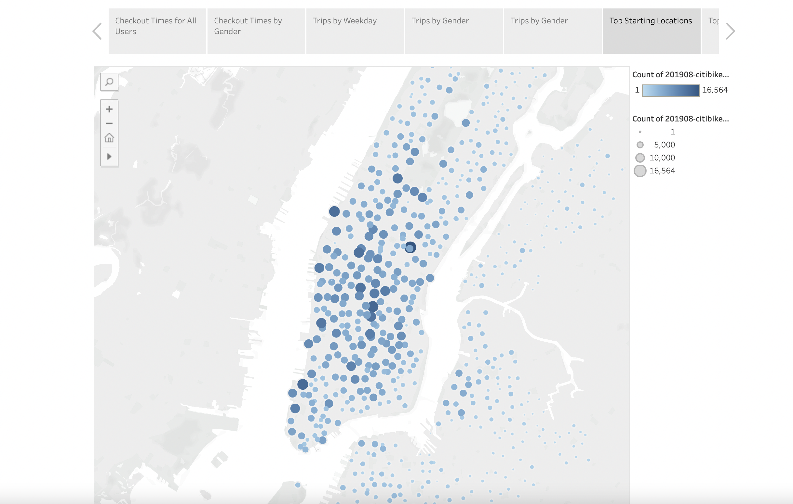
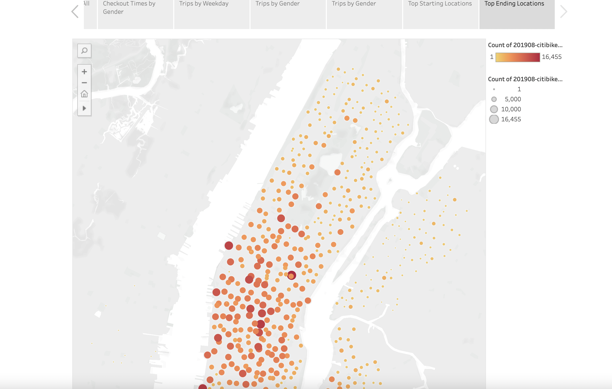
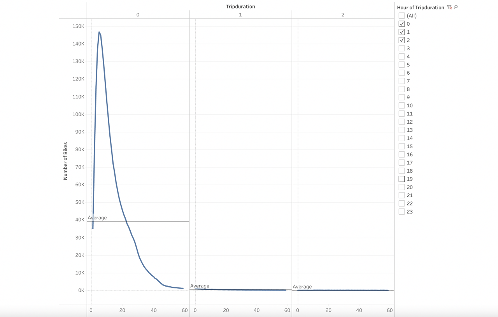
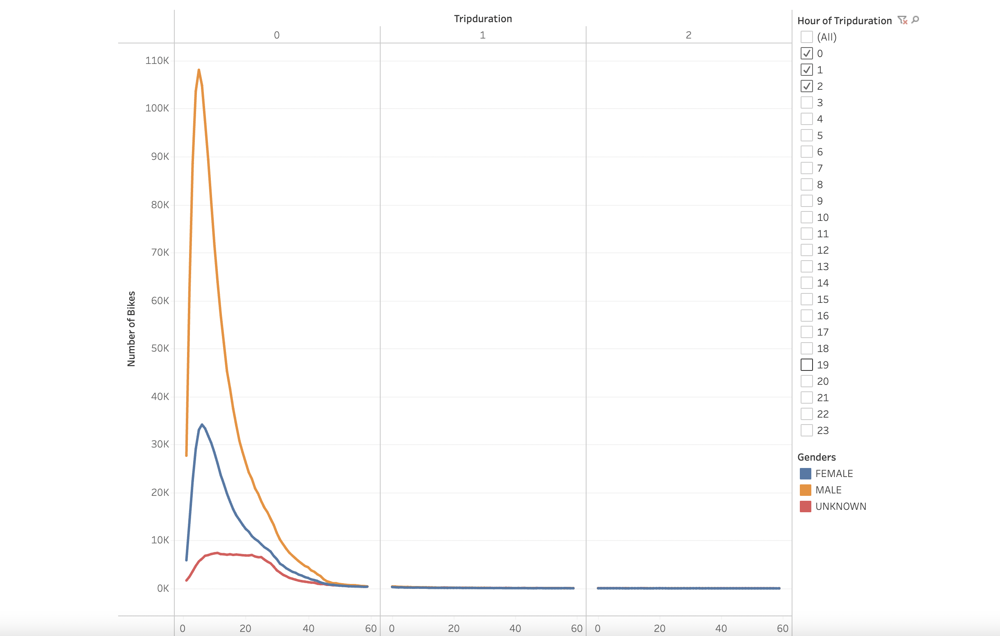
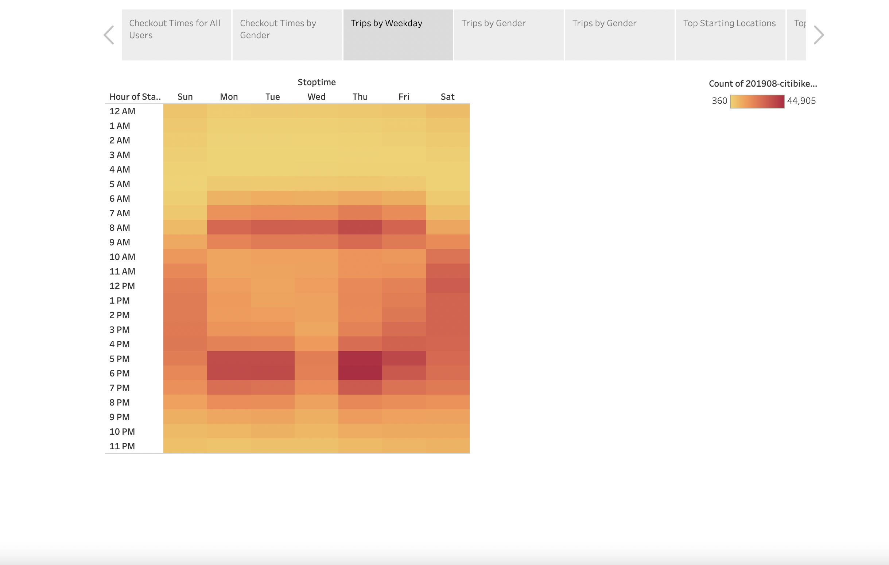
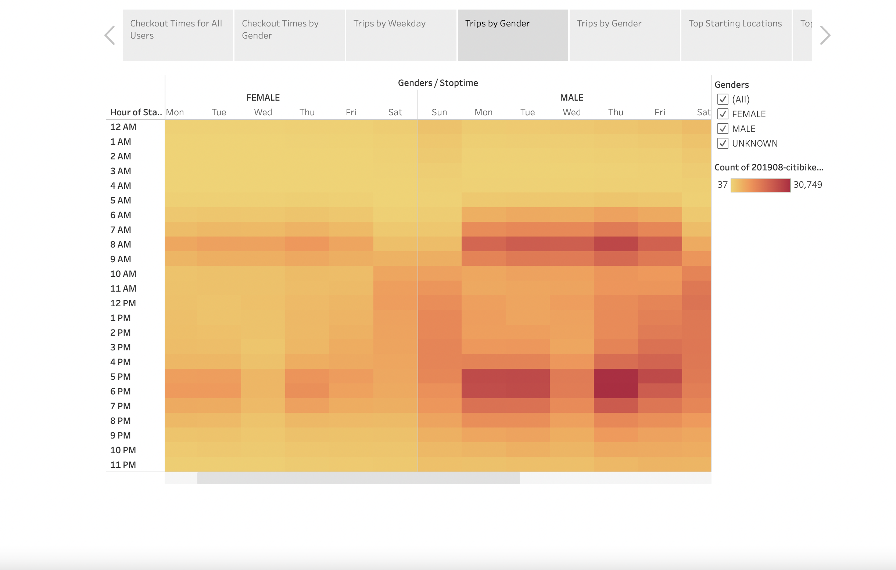
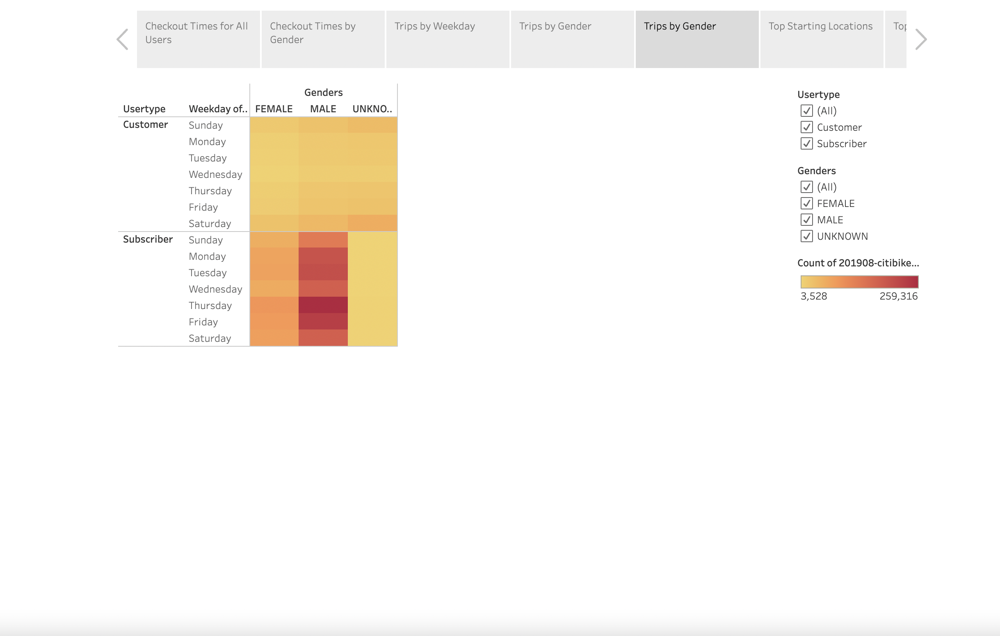

# bikesharing
Bike sharing data analysis of a months worth of Citibike data in NYC

## Overview
### The scope of this project was to visualize a months worth of Citibike data in New York City to see if it would be useful for a similar program in Des Moines. The first step was to convert the raw data (tripduration) from an integer into a datetime datatype. This would allow the data to be more easily visualized in Tableau and creating a storyboard that could be translated to success in Des Moines.

## Results
### The result of the data analysis and visualization is located [here](https://public.tableau.com/views/NYCCitybikeData/Story1?:language=en-US&:display_count=n&:origin=viz_share_link)

### The story contains both the most popular starting and ending points graphed to a map of NYC. The data shows that the majority of the bike trips start or end in the downtown areas where traffic is probably heaviest:

### It also contains a breakdown of of the length of each bike checkout for all users and also by gender. Both can be filtered:

### The story also contains 3 heatmaps showing the number and time of trips by weekday:

### The number and time of trips by gender each weekday:

### and lastly, a breakdown of customer or subscriber days using the Citibikes (filtered by gender):

## Summary
### This was a good exercise in Data Analytics and Visualization and we learned some things about the habits of NYC Citibike users. Male subscribers check out the most bikes every day and the prime hours are from 6AM-9AM and 4PM-7PM. It may not be easy to see how this is applicable in recreating this idea in Des Moines. A few more visualizations could help us if we were able to run the same analysis with cabs / ubers / cars. Also a population density study of NYC starting and ending locations compared to a population density map of Des Moines might give us a clearer picture as to whether this can be replicated.
